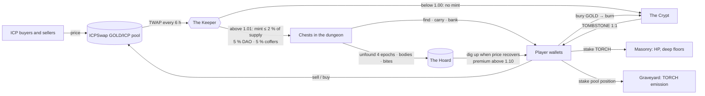
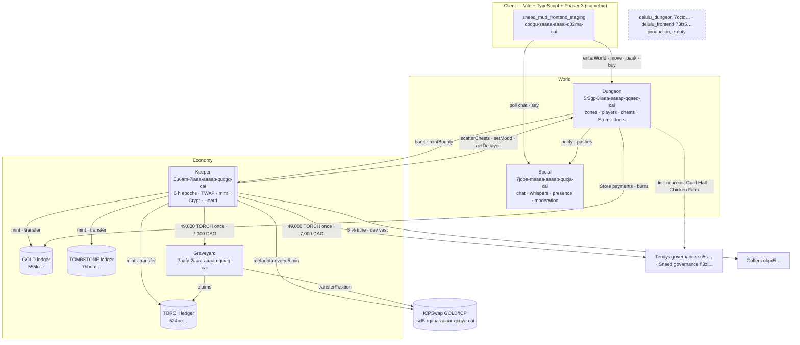
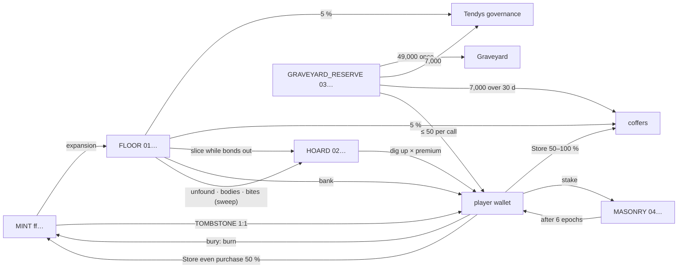

# Delulu Canyon

**An algorithmic peg whose seigniorage is delivered as loot, and whose reserve is fed by the world's losses.**

Delulu Canyon is an isometric MMORPG on the Internet Computer built around a Tomb Finance-style three-token peg. GOLD is pegged 1:1 to ICP. Every six hours a canister called the Keeper reads the GOLD/ICP price on ICPSwap; when GOLD trades above the peg it mints new GOLD — but instead of paying it to stakers, it hides it as chests in a persistent dungeon world. Players have to find the chests, carry the gold through danger, and bank it at a vault before it is theirs. When GOLD trades below the peg nothing mints, the world goes dark, and the Crypt sells bonds for burned gold.

The second idea is the **Hoard**. Tomb's bond reserve was fed only by a slice of each expansion, so its contraction side depended on faith. Here the reserve is also fed *involuntarily*: chests nobody found in four epochs, bodies nobody reclaimed, gold bitten off by skeletons — every loss the world produces backs the bonds. Neglect in the dungeon funds the defence of the peg. The full argument is in [docs/WHITEPAPER.md](docs/WHITEPAPER.md); the numbers behind it are in [docs/TOMB_MECHANICS.md](docs/TOMB_MECHANICS.md).

---

## Contents

1. [How it plays](#how-it-plays)
2. [The economy in one loop](#the-economy-in-one-loop)
3. [Tokens](#tokens)
4. [The Keeper](#the-keeper)
5. [The Graveyard](#the-graveyard)
6. [Where players touch a ledger](#where-players-touch-a-ledger)
7. [Architecture](#architecture)
8. [Accounts that matter](#accounts-that-matter)
9. [Security & audit status](#security--audit-status)
10. [Status & roadmap](#status--roadmap)
11. [Development](#development)
12. [Documents](#documents)
13. [Credits & licence](#credits--licence)

---

## How it plays

You wash up at the harbour of **Luméira**, a walled town at the centre of a 128×128 overworld. The great Obelisk in the plaza glows with the Keeper's mood — gold when the world is expanding, dim when it is quiet, cold blue when it is dark. Portals at the town's edge lead to the dungeons (Antechamber → Bone Halls → Deep Vault, the Drowned Chapel, Smugglers' Grotto), the surface districts (Lanternfall, Highland Pass, Hallowmere with its Crypt), and the ring zones (Castle Tower, Dragon Sanctum, Luminescent Grove, Crumbly Hearth, the Chicken Farm, the Guild Hall).

- **Find and bank.** Chests appear when the Keeper expands. Open one and the gold is *carried* — in-game state, at risk. Bank it at the vault and it becomes GOLD in your wallet.
- **Die and the gold stays on your body** for four epochs; reclaim it or it goes to the Hoard. Dark-mood skeletons bite 5 % of what you carry.
- **TORCH** is the share token. Stake it at the Masonry (Lanternfall) for more HP and entry to deeper floors; stake a GOLD/ICP position at the Graveyard (Hallowmere) to earn it.
- **The Crypt** (Hallowmere) is the bond market: bury GOLD during a contraction for TOMBSTONE, dig it up with a premium when the price recovers.
- **The Store** (Old Bessany, town) sells food, eggs, weapons and repairs for GOLD; pets hatch from eggs and lay more when fed; the cauldrons craft from bone dust; two doors are gated by DAO neurons.

The player guide — first ten minutes, moods, health, torches, the Crypt, eggs and the Store — is [docs/HOW_TO_PLAY.md](docs/HOW_TO_PLAY.md), also available in-game with `H`. Short answers: [docs/FAQ.md](docs/FAQ.md).

---

## The economy in one loop



The rule in one line: demand above the peg makes gold appear as chests, but only for players who go and get it; below the peg nothing mints, bonds soak up gold, and what players lost pays them back.

---

## Tokens

Three ICRC ledgers (PanIndustrial `icrc-fungible` 0.2.1, Motoko; ICRC-1/2/3/4 + ICRC-107 fee collector; 8 decimals; fee 0.0001; minimum burn 0.0001). The Keeper is the only minter.

| | GOLD | TORCH | TOMBSTONE |
|---|---|---|---|
| Tomb name | TOMB — money, peg 1 GOLD = 1 ICP | TSHARE — ownership | TBOND — bond |
| Ledger | `555lq-jaaaa-aaaap-quxha-cai` | `524ne-eyaaa-aaaap-quxhq-cai` | `7hbdm-xqaaa-aaaap-quxia-cai` |
| Minting account | Keeper `5u6am-7iaaa-aaaap-quxgq-cai` + subaccount `ff`×32 (transfers *to* it burn, *from* it mint) | same | same |
| Fee collector | coffers `okpx5-c7nln-u3qii-ub55e-374ug-kjede-segkn-jgbv5-dkbfr-m55ma-yqe` (collected since GOLD block 29) | same | same |
| Supply, 28 Aug 2026 | 120,887 | 70,801 | 0 |

**Keeper subaccounts** (tag byte + 31 × `00`): `ff…` MINT · `01…` FLOOR (gold minted as chests, not yet banked) · `02…` HOARD (bond reserve) · `03…` GRAVEYARD_RESERVE (the 70,000 TORCH budget) · `04…` MASONRY (staked TORCH).

**TORCH allocation** (70,000 minted once to the reserve; nothing released yet): 49,000 Graveyard emission over 365 days · 7,000 DAO (Tendys governance, immediate) · 7,000 dev (coffers, 30-day linear vest pushed by the Keeper) · 7,000 events (≤ 50 per call, ≤ 200 per player; 25 each to early testers at launch).

---

## The Keeper

Canister `5u6am-7iaaa-aaaap-quxgq-cai` (`src/keeper`). Full reference: [docs/KEEPER_API.md](docs/KEEPER_API.md); verified analysis: [docs/TOMB_MECHANICS.md](docs/TOMB_MECHANICS.md).

**Epoch.** 21,600 s (6 h), aligned to the clock. Every 300 s the Keeper reads `pool.metadata()` on the ICPSwap pool `jscl5-rqaaa-aaaar-qcgya-cai` (GOLD is token0) and keeps the sample if it is within 25 % of the epoch's running median. At the boundary the TWAP is the mean of the surviving samples. Fail-safes → **Stable, no mint, no Crypt**: fewer than 3 samples; pool liquidity below `minPoolLiquidity`; pool or supply unreadable (observed working on mainnet).

**State machine.** TWAP > 1.01 → **Expansion** · TWAP < 1.00 → **Contraction** · else **Stable**. The mood (Bright / Dark / Quiet) is pushed to the dungeon.

**Expansion**

```
tier(supply) = 4.5 % below 500k GOLD · 4 % < 1M · 3.5 % < 1.5M · 3 % < 2M · 2.5 % < 5M · 2 % < 10M · … · 1 %
pct          = min(twap − 1, tier, cap 2 %)
minted       = supply × pct                                      MINT → FLOOR
tithe        = 5 % of minted → Tendys governance, 5 % → coffers
toHoard      = only while bonds are out: min((minted − tithe) × 65 %, debt − hoard)
chestGold    = minted − tithe − toHoard                           scattered as chests
premiumRate  = twap ≥ 1.10 ? 1 + (twap − 1) × 70 % : 1
scatter      = zone weight × U[0.5, 1.5], ⅓ chance one zone dropped; chests per zone = max(4, gold / 50)
```

**Worked example — epoch 14, 28 Aug 2026 (the first pool-priced epoch).** Supply 118,517; TWAP 1.0229 → capped at 2 %: **2,370.34 GOLD minted**, 118.52 to Tendys and 118.52 to the coffers, **2,129 GOLD placed in 47 chests** across nine zones (Deep Vault 540, Bone Halls 437, Drowned Chapel 261, Antechamber 198, Luméira 159, Hallowmere 156, Highland Pass 174, Grotto 153, Lanternfall 51). At full expansion that is ~8 % of supply per day.

**Contraction — the Crypt.** `bury` burns GOLD and mints TOMBSTONE **1:1** (Tomb sold at the TWAP; here the only upside is the premium), at most 3 % of supply per epoch and 35 % total debt. `digUp` during expansion pays `amount × premiumRate` from the HOARD. A failed second leg is credited to `owed` and retried with `claimOwed`.

**Decay sweep.** At every allocation the Keeper asks the dungeon for decayed gold — chests older than 4 epochs, bodies older than 4 epochs, skeleton bites — and moves it FLOOR → HOARD.

**Masonry.** `stake` TORCH → `hpMax = 1,000 + 10 × torches`; portal gates need 10 / 50 / 200 TORCH for the Chapel / Bone Halls / Deep Vault. `requestUnstake` unlocks after 6 epochs. (Action points are frozen; stake no longer affects them.)

**Safety controls, live since 28 Aug 2026** (commit `a05309f`):

| control | what it does |
|---|---|
| `finishGenesis()` | controller one-shot; afterwards `adminMint` refuses for good (not yet flipped on staging — the cut-over re-mints the TORCH reserve first) |
| `setManualPrice` | controller-only, and refused while a pool is configured |
| operator `tick` | one forced allocation per epoch length; controllers unlimited |
| `bank` | pays FLOOR → HOARD → mints only the remainder, counted in `shortfallMinted` and logged |
| `mintBounty` | capped per **epoch** (1,000 GOLD), not per call |
| reconciliation | each allocation reads the dungeon's `goldInWorld` and records FLOOR − in-world drift |
| `getSafety()` / `getOperatorPowers()` | expose all of the above |

Who can do what: Keeper **controllers** (`xzm74…`, Tendys root) — config, reserve releases, `finishGenesis`; **operator** (`2mr63…`, the in-game admin) — mood, one `tick` per epoch; the **dungeon canister** — `bank`, capped `mintBounty`, capped `grantEventTorch`; **players** — bank, stake, bury, dig up.

---

## The Graveyard

Canister `7aafy-2iaaa-aaaap-quxiq-cai` (`src/graveyard`) — Tomb's Cemetery on ICPSwap v3, which has no LP token. Code installed; **not yet initialised** (waits for the reserve release). Reference: [docs/GRAVEYARD_API.md](docs/GRAVEYARD_API.md).

- **Custody by transfer.** The player `approvePosition`s their GOLD/ICP position to the Graveyard and calls `stake`; the Graveyard checks ownership, no open limit orders, full-range ticks (±887,220) and positive liquidity, takes the position with `transferPosition`, and snapshots its liquidity. `unstake` returns it. Swap fees earned in custody stay on the position (`claimFees`). A controller escape hatch returns any orphaned position.
- **Emission.** 49,000 TORCH over 365 days = 134.25 per day = 33.56 per epoch, by reward-per-share (`accPerLiquidity` scaled 1e18); `claim` from 0.01 TORCH; no lock-up. Intervals with no stakers are forfeited.
- If ICPSwap pauses or upgrades, transfers trap and `unstake` is simply retryable — positions are never lost, only stuck until the pool answers.

---

## Where players touch a ledger

| action | in the game | movement |
|---|---|---|
| open a chest | any zone | none — carried gold is in-game state |
| bank | vault tile, town / harbour | GOLD FLOOR → player |
| die carrying gold | anywhere | body holds it 4 epochs, then → HOARD at the next sweep |
| skeleton bite (Dark mood) | dungeons | 5 % of carried → HOARD at the next sweep |
| buy at the Store | Old Bessany, town | `icrc2_approve` then `buy`: odd purchase 100 % → coffers; even purchase 50 % → coffers + 50 % **burned** (→ the minting account) |
| repair | same counter | dagger 25 GOLD + 5 bone dust · Gabriel's Sword 2,000 GOLD + DragonScale; same split |
| stake / unstake TORCH | the Masonry, Lanternfall | TORCH player ↔ MASONRY (6-epoch lock) |
| bury / dig up | the Crypt, Hallowmere | GOLD → burn, TOMBSTONE 1:1 · TOMBSTONE → burn, GOLD from HOARD × premium |
| Graveyard stake / claim | Brannock's plots, Hallowmere | position custody; TORCH Graveyard → player |
| dragon bounty | outdoor zones, every 15 epochs | GOLD minted → damagers (500 split; ≤ 1,000 per epoch) |
| epoch tithes | automatic | FLOOR → Tendys 5 %, coffers 5 % |
| every transfer | — | 0.0001 fee → coffers |

---

## Architecture



### Canister registry — as of 28 Aug 2026

All on subnet `nl6hn…`. 
| role | dfx name | principal | state | cycles | memory |
|---|---|---|---|---|---|
| Keeper | `keeper` | `5u6am-7iaaa-aaaap-quxgq-cai` | live — reads the pool; safety round deployed | 3.0 T | 8 MB |
| GOLD ledger | `gold_ledger` | `555lq-jaaaa-aaaap-quxha-cai` | live — kept at cut-over | 1.5 T | 29 MB |
| TORCH ledger | `torch_ledger` | `524ne-eyaaa-aaaap-quxhq-cai` | live — reinstalled at cut-over | 1.5 T | 13 MB |
| TOMBSTONE ledger | `tombstone_ledger` | `7hbdm-xqaaa-aaaap-quxia-cai` | live — reinstalled at cut-over | 1.5 T | 9 MB |
| Graveyard | `graveyard` | `7aafy-2iaaa-aaaap-quxiq-cai` | code installed, not `init`ed | 0.7 T | 6 MB |
| Social | `social` | `7jdoe-maaaa-aaaap-quxja-cai` | live — v1.1.0 with moderation | 0.6 T | 7 MB |
| ICPSwap pool | — | `jscl5-rqaaa-aaaar-qcgya-cai` | GOLD/ICP 0.3 %, GOLD = token0 | — | — |
| Dungeon (production) | `delulu_dungeon` | `` | empty | 1.1 T | — |
| Client (production) | `delulu_frontend` | `` | empty | 1.1 T | — |

Idle burn across the ten is ~28 B cycles/day (~0.86 T/month) as of 28 Aug 2026, two-thirds of it the staging dungeon; a canister snapshot doubles a canister's reported memory (and burn) while it exists.

### Money flow between the Keeper's accounts




## Credits & licence

- Forked from [Snassy-icp/sneed_mud](https://github.com/Snassy-icp/sneed_mud) (MIT) — Internet Identity login, presence, chat and the stable-state scaffolding came from there.
- The economics are Tomb Finance's three-token seigniorage design, with the Hoard added.
- Ledgers: PanIndustrial `icrc-fungible` (ICRC-1/2/3/4/107). DEX: ICPSwap v3. DAO gates: Sneed and Tendys SNS governance.
- Client: Vite, TypeScript, Phaser 3.

Licensed under the MIT License — see [LICENSE](LICENSE).
