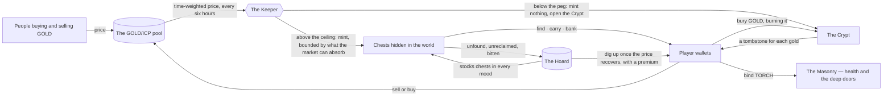

# Delulu Canyon

**An algorithmic peg whose seigniorage is delivered as loot, and whose reserve is fed by the world's losses.**

> **[Audit log](docs/audit-1.md)** · **[Changelog](CHANGELOG.md)** — what our internal
> audit found before we open to strangers, what has been fixed, and what is still open.
> Current build: **0.16.0**.

Delulu Canyon is an isometric MMORPG on the Internet Computer whose economy is a
Tomb Finance–style three-token peg. GOLD is meant to be worth one ICP. Every six
hours the Keeper — a canister that does nothing but watch the price and decide —
reads the time-weighted price of GOLD against ICP. When GOLD trades above the
peg the Keeper mints more of it; but instead of paying that new gold to stakers,
it **scatters it as chests across a persistent world**. Players have to find a
chest, carry the gold through whatever lies between them and safety, and bank it
at a vault before any of it is theirs. When GOLD trades below the peg nothing is
minted at all: the world turns Dark, and the Crypt opens to sell bonds for gold
that is burned.

How much the Keeper mints is bounded by **what the market can actually absorb**,
not just by how much GOLD exists. A mint large enough to push the price further
from the peg is not a defence of the peg, so the Keeper will not make one: when
the market is thin it creates little, and when the market is deep it can create
more.

The second idea is the **Hoard**. In Tomb, the bond reserve was fed by one thing
— a slice of each expansion — so the contraction side of the machine depended on
belief, and every notable fork died when belief ran out. Here the reserve is also
fed *involuntarily*: chests nobody found before they crumbled, bodies nobody
walked back to reclaim, gold bitten off the careless while the world is Dark.
Every loss the world produces becomes backing for the bonds. Neglect in the
dungeon funds the defence of the peg, and the patient are paid by the careless.

The Hoard also stocks the floors. Gold chests appear in **every** mood, not only
when the Keeper is minting — funded by that same recovered gold, so the world's
losses come back out as the world's rewards and nothing new has to be created to
keep the dungeon worth walking into.

## The documents

| | |
|---|---|
| [Architecture](docs/architecture.md) | The canisters, what each is responsible for, and why the machine is split this way |
| [The Keeper](docs/the-keeper.md) | The algorithm in full — sampling, the three moods, expansion, contraction, the bond, the fail-safes |
| [The world](docs/the-world.md) | How the algorithm lands in the game: chests, carrying, death, decay, and the places the economy lives |
| [Tokens](docs/tokens.md) | GOLD, TORCH and TOMBSTONE — what each is for, how each is made and destroyed |
| [Field guide](docs/field-guide.md) | For players: where to go and what is worth doing in each of the Keeper's moods |
| [Quests and things to do](docs/quests.md) | For players: the quest chains, the board, crafting, pets, curios, the shops and the pub |
| [How the peg drives the game](docs/how-the-peg-drives-the-game.md) | The monetary machine and the minute-to-minute play, drawn out: the moods, where a mint goes, and what fills the Hoard |
| [Lineage](docs/lineage.md) | Where this economy comes from, where that family of designs breaks, and what we do differently |
| [Capacity and cycles](docs/capacity-and-cycles.md) | How many people can play at once, what actually limits it, and what it costs to run a game where the canister pays for every message |
| [Audit 1](docs/audit-1.md) | What our internal audit found before opening to strangers, what has been fixed, and what is still open |
| [Activities](docs/activities.md) | Curios, the Collector, NPC trade, fishing, the ferry, the inn and the Ossuary |

## What this is not

The three tokens are game tokens. They are created and destroyed by published
rules running on canisters, and nothing about them is a promise of value. The peg
is a mechanism, not a guarantee: it is an algorithm that adjusts supply, and it
can and will fail to hold at times. Nothing here is an offer, an investment, or
advice.
