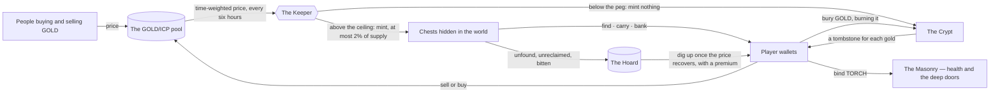

# Delulu Canyon

**An algorithmic peg whose seigniorage is delivered as loot, and whose reserve is fed by the world's losses.**

Delulu Canyon is an isometric MMORPG on the Internet Computer whose economy is a
Tomb Finance–style three-token peg. GOLD is meant to be worth one ICP. Every six
hours the Keeper — a canister that does nothing but watch the price and decide —
reads the time-weighted price of GOLD against ICP. When GOLD trades above the
peg the Keeper mints more of it; but instead of paying that new gold to stakers,
it **scatters it as chests across a persistent world**. Players have to find a
chest, carry the gold through whatever lies between them and safety, and bank it
at a vault before any of it is theirs. When GOLD trades below the peg nothing is
minted at all: the world turns Dark, and the Crypt opens to sell bonds for gold
that is burned.

The second idea is the **Hoard**. In Tomb, the bond reserve was fed by one thing
— a slice of each expansion — so the contraction side of the machine depended on
belief, and every notable fork died when belief ran out. Here the reserve is also
fed *involuntarily*: chests nobody found before they crumbled, bodies nobody
walked back to reclaim, gold bitten off the careless while the world is Dark.
Every loss the world produces becomes backing for the bonds. Neglect in the
dungeon funds the defence of the peg, and the patient are paid by the careless.

## The documents

| | |
|---|---|
| [Architecture](docs/architecture.md) | The canisters, what each is responsible for, and why the machine is split this way |
| [The Keeper](docs/the-keeper.md) | The algorithm in full — sampling, the three moods, expansion, contraction, the bond, the fail-safes |
| [The world](docs/the-world.md) | How the algorithm lands in the game: chests, carrying, death, decay, and the places the economy lives |
| [Tokens](docs/tokens.md) | GOLD, TORCH and TOMBSTONE — what each is for, how each is made and destroyed |
| [Field guide](docs/field-guide.md) | For players: where to go and what is worth doing in each of the Keeper's moods |
| [Capacity and cycles](docs/capacity-and-cycles.md) | How many people can play at once, what actually limits it, and what it costs to run a game where the canister pays for every message |

## What this is not

The three tokens are game tokens. They are created and destroyed by published
rules running on canisters, and nothing about them is a promise of value. The peg
is a mechanism, not a guarantee: it is an algorithm that adjusts supply, and it
can and will fail to hold at times. Nothing here is an offer, an investment, or
advice.
