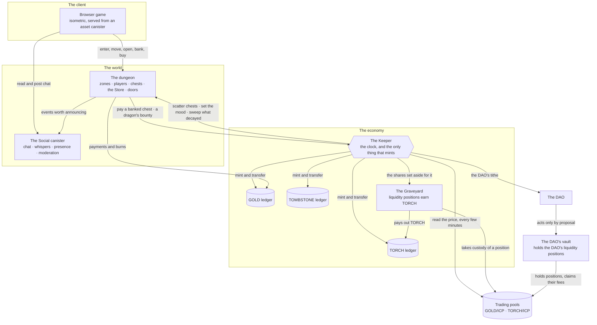

# Architecture

Delulu Canyon is not one program. It is a small set of canisters that each do one
job, talk to each other over the Internet Computer, and can be reasoned about
separately. This document names them and explains why the line between them falls
where it does.

Canisters are referred to by name throughout — *the Keeper*, *the dungeon*, *the
Graveyard*. Their addresses are public and on-chain, and they are listed in one
place, [canisters.md](canisters.md), so that a reader can check they are talking
to the real thing and a move changes one file.

## What each one does

**The dungeon** holds the world: the zones and their maps, where every player is
standing, what is in their pack, the chests lying on the ground, the Store, the
doors, the quests. It owns no tokens on a player's behalf. Its job is to decide
*who has earned what* — and then to ask the Keeper to pay it.

**The Keeper** is the treasury and the clock. It samples the price of GOLD,
decides once per epoch whether the world expands, sits still or contracts, and it
is **the only canister that can mint**. It holds the Hoard, runs the Crypt, holds
bound torches, and pays a banked chest out of its own float. It knows nothing
about maps, monsters or quests — it knows how much gold exists and what the price
is doing.

**The three ledgers** are ordinary ICRC-1/2/3 token ledgers, one per token. They
are not special-cased for the game: any wallet can hold GOLD, and a transfer
between two players is a plain ledger transfer that the game never sees.

**The Social canister** carries chat, whispers, presence and moderation. It is
separate so that a busy chat cannot slow the world down, and so that moderation
tools can be changed without touching the economy.

**The Bazaar** is the trading canister. It takes custody of tokens a player
deposits, holds standing offers so two players need not be online at the same
moment, and settles a trade completely or not at all. It also holds the value
behind every player-sealed crate while the crate itself travels the world — the
crate is a pointer; the tokens never leave the Bazaar's books. It publishes
those books, checks them against the ledgers on a timer, and stops rather than
pays if they ever disagree.

**The Graveyard** takes custody of liquidity positions from the trading pools and
pays TORCH for them over a fixed emission window. A planted position is held by
the canister, not by us; it can be uprooted at any time and walks straight back
to its owner.

**The DAO's vault** holds liquidity positions owned by the DAO rather than by any
person. It can only be operated through governance proposals, so the liquidity
underneath the peg is not something an individual can withdraw.

## Why it is split this way

The important line is between **the Keeper's mint and the world it scatters
into**. They are two different problems with two different failure modes.

The mint is arithmetic on a price. It must be conservative, boring, and hard to
influence: it reads a time-weighted average, throws away outliers, refuses to act
on too little data, and caps how much it can create in one turn. It is the kind
of code you want small enough to hold in your head.

The world is the opposite: large, stateful, full of maps and monsters and
inventories, changed often as the game grows. It is where bugs live, because it
is where the complexity is.

Keeping them in separate canisters means a change to the dungeon cannot change
how much gold exists, and a bug in the world cannot mint. The dungeon can *ask*
the Keeper to pay a player who banked a chest, and the Keeper answers out of gold
it already minted for that purpose — but the dungeon has no power to create any.
Every path that could increase supply lives in one small canister with one
published rule.

The same reasoning puts liquidity in the Graveyard and the vault, and traded
tokens in the Bazaar, rather than in the dungeon. Custody should sit in a canister small enough to audit, and boring
enough that it rarely changes.

## What the client does and does not do

The client is a browser game that talks to the canisters directly with the
player's own identity. It holds no keys for anyone else and has no privileged
access: everything it can do, it does as the player. Reading the world is a query;
anything that changes the world is a signed call from that player.

The canisters refuse anonymous writes and rate-limit the ones they accept. The
specifics are deliberately not published — a defence reads differently when you
know exactly where its edges are.
