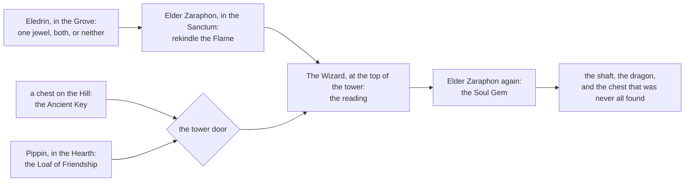
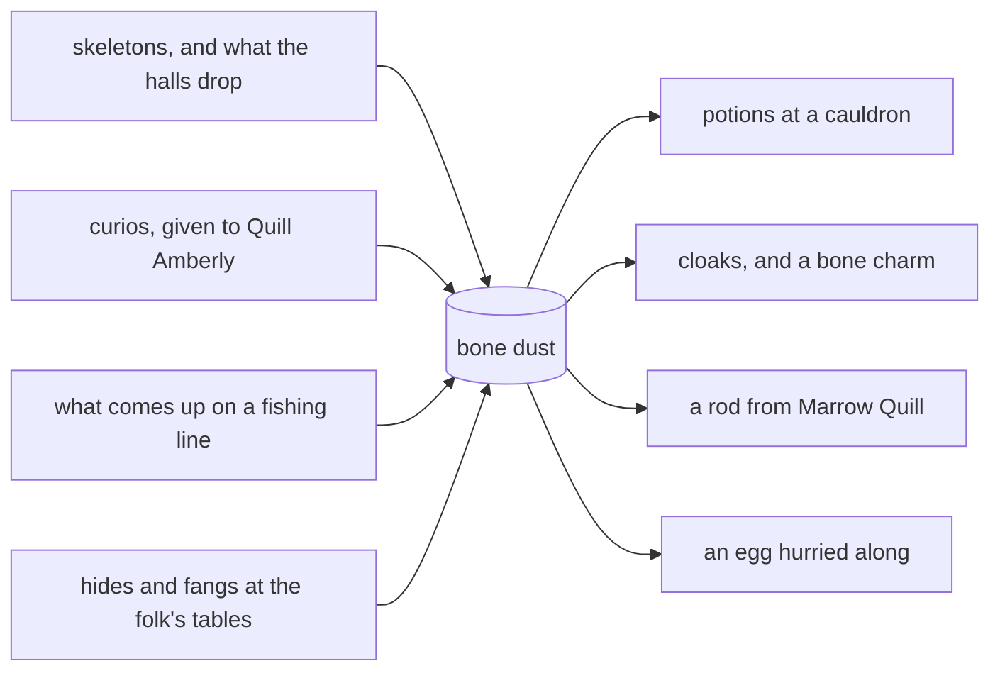

# Quests, and things to do

The [field guide](field-guide.md) tells you *when* to do a thing — which six hours
of the day suit hunting, sweeping or burying. This is the other half: the list of
things there are to do at all, and the people who will ask you to do them.

Press **J** for your quest log, **H** for help, **M** for the map, **I** for your
pack, **L** for the leaderboards, **G** for the guild doors and **K** to watch the
Keeper think. Space or F is the action key: it opens what you are standing on and
talks to whoever you are standing beside.

---

## Your first hour

You wash up at the harbour with a thousand points of health, no torches and no
reputation. There is a sign a few steps from where you land, and it is worth
reading, because it says the one thing nothing else will tell you.

1. **Open the chest a few steps from where you woke.** The harbour leaves one
   there for everyone who arrives.

2. **Carry what is inside to the vault on the plaza and bank it.** This is what
   opens your account. Until you have banked gold from one of the Keeper's own
   chests, the vault will hold the harbour's welcome for you but will not pay it
   out. One walk clears that for good.

3. **Talk to Marrow Quill**, the harbourmaster. He gives you **First Light**: the
   plaza, a chest, the vault, in that order. It is the whole of Luméira in three
   steps, and it pays a quarter of a gold and two points of standing.

4. **Talk to Old Isolde**, the torchbearer, in town. She wants five handfuls of
   bone dust and will bind you **two torches and a lantern** for them. The lantern
   widens what you can see by two tiles, which is more useful in the dark than it
   sounds, and torches are what the deep doors are barred against.

5. **Read the Keeper's Board** in town. There are two posts on it, they change
   with the day, and they are the easiest half a gold in the canyon.

6. **Pick up any egg you tread on.** They are lying about everywhere, above ground
   and below. They cost you nothing to carry and they hatch into chickens.

That is an hour. After it you have banked gold, a lantern, two torches, a quest
log with something in it, and a hen on the way.

---

## The quest chains

There are fifteen quests at present, given out by name, face to face — you must
be standing beside the giver to take one and standing beside them again to turn
it in. You may carry **five at a time**. The log names your next step and points
at where it is. Abandoning one costs you a point of standing; finishing any one
at all earns you a point, on top of whatever else it pays.

Ten are in the canyon, four are on Space World, and one crosses between them.

Gold rewards arrive as a **pouch**, not as banked coin, so they come home the same
way chest gold does: to the vault, on your own two feet.

### The ten

| quest | who gives it | where | what it asks |
|---|---|---|---|
| **First Light** | Marrow Quill | Luméira | The plaza, a chest, the vault |
| **A Torch for the Dark** | Old Isolde | Luméira | Five bone dust |
| **Eggs for the Farmwife** | Hedda Furrow | the Farmsteads | Two eggs, and five fewer rats in her hay |
| **The Bonewright's Order** | Ossian Blackwright | Luméira | A potion brewed by your own hand, and four hides |
| **Three Verses** | Pell the Bard | Luméira | Stand in Lanternfall, in Hallowmere, and in the Highland Pass |
| **The Jewels of Karma** | Eledrin | the Luminescent Grove | A choice: one jewel, both, or neither |
| **The Flame of Energy** | Elder Zaraphon | the Dragon Sanctum | Three skeletons laid down, then back to the brazier |
| **Bread for the Road** | Pippin | the Crumbly Hearth | Three enchanted herbs, fresh |
| **The Wizard's Reading** | The Wizard of Luméira | the Castle Tower | Get to the top of the tower and hear him out |
| **The Soul Gem** | Elder Zaraphon | the Dragon Sanctum | The shaft, the dragon, and the chest at the bottom |

Two of them come round again. **Eggs for the Farmwife** can be taken afresh after
a couple of days, and **Bread for the Road** after a few more; the rest are once
each, for good.

### The four on Space World

Given by the station's own people, in the order the world opens up: the Drydock,
then the Mast, then the Assay, then the Long Wake.

| quest | who gives it | what it asks |
|---|---|---|
| **Cold Start** | Dockmaster ORION-4 | Three power cells from the item chests out among the planets, then take the airlock and stand inside the Orbital |
| **The Solar Gale** | Watch-officer VELA-3 | Twelve stardust from the Orbital's dispensers, then ride the Ringed One's gate down to the Space Race |
| **Down the Riddled Rock** | Assayer LIBRA-5 | Wear the star-suit, open the hatch, go down, and put six of the things nesting in the Warrens down |
| **The Ink and the Answer** | Ranger DRACO-6 | Down through the Crater Warrens to the Ink Deep, and bring the Void Octopus down — **it is a raid, not a duel** |

### The one that crosses

**The Lesser Seal**, from **Underclerk Pettifor** at his desk in the Chamber of
Commerce. He has lost a key — small, brass, bites at one end. It opens the Lesser
Seal press, and the Lesser Seal press opens *nothing*, but he is responsible for
it.

The press went up to the Solar System office for calibration, quarterly, and came
back without the key. Something down in the dark has it now. You will have to go
to **Space World**, down into the **Ink Deep**, take it off whatever has it, and
carry it home. Pay is deliberately small in gold and large in standing: the title
is the point.

**If you have already raided the Ink Deep, you are not shut out.** The key rides
the chest's repeat reward rather than its named prize — exactly so the people who
went down there first are not the ones locked out of the errand. Open it again.

### The long one

Five of the ten are a single chain, and it is the only piece of the world that
asks you what sort of person you are and then answers.

Eledrin offers two jewels, one that lifts your standing and one that lowers it.
Take either, both, or neither. Nothing about that choice is wrong and all of it is
remembered.

Zaraphon's brazier wants three skeletons laid down with a jewel's weight in your
pack. Rekindle it and the Flame burns bright for a turn — the chests that hold
goods rather than gold refill twice over while it does — and you keep an enchanted
shield.

The tower door wants two things at once. The **Ancient Key** sits in a chest on
the Hill, in a fixed place, the same for everyone; if somebody takes it, another
appears in time — and Old Bessany keeps one on her shelf for ten gold, if you
would rather buy than hunt. The **Loaf of Friendship** is baked by Pippin out of three
enchanted herbs, which the wisps of the Grove carry and drop a few at a time. The
loaf heals two hundred and fifty if you eat it and opens the door if you don't,
and Pippin will tell you plainly that you cannot do both.

At the top, the Wizard weighs everything you have done since the harbour. The
generous leave with three greater potions. The grasping leave with a dagger. The
balanced leave with a door open that was shut, and a dragon behind it — Zaraphon
hands them the Soul Gem, and the shaft from the Sanctum goes down to the Soul Gem
Vault. Finish that and the canyon calls you **Dragon Paladin Wizard**, and it only
ever hands that name out once.

---

## The Keeper's Board

The noticeboard in Luméira town carries **two posts, and they change with the
day**. They are drawn from five standing requests, never the same one twice on
one day, and they are deliberately things you were going to do anyway:

- Bank gold at the vault — the post names the amount.
- Slay ten beasts.
- Lay twelve skeletons down.
- Open eight chests.
- Brew twice at a cauldron.

Each one pays **half a gold** and a point of standing. The gold comes out of the
treasury rather than being minted, so on a lean day the coin may not be there —
the standing is yours either way. There is nothing to accept and nothing to
abandon: the Board simply notices, wherever you happen to be when you do the work.

Pinned beneath the posts are the sightings: where each of the two road-traders was
**last seen by somebody**, and how many turns ago.

---

## Bone dust, and the crafting loop

Bone dust is the canyon's second currency. Every skeleton you lay down leaves
some; deeper halls and older bones leave more. Almost everything that is not gold
is bought with it.

Stand at a cauldron — Lanternfall's masonry keeps one, and there is another in
Hallowmere — and brew:

| brew | what it takes |
|---|---|
| A minor potion | 5 bone dust |
| A lesser potion | 15 bone dust |
| A greater potion | 60 bone dust |
| Grub Mash (pet food) | 10 bone dust and a hardtack |
| A Hide Cloak | 4 hides and 10 bone dust |
| A Wisp Lantern | 3 wisp-lights and a feather |
| An Ashen Cloak | 5 ashen threads and 20 bone dust |
| A Bone Charm | 100 bone dust and a dragon's scale |

The cloaks are the ones to want. A **Hide Cloak** halves what the beasts do to
you, and their venom does not take. An **Ashen Cloak**, spun from the dark elf
wizards' own thread, halves their bolts — which is the difference between the
third floors being a trip and being a story. A **Wisp Lantern** shows you three
tiles further than bare sight. A **Bone Charm** adds a twentieth to every blow you
land.

If you ever find a **Bonecaster's Ring** in the deep, every recipe above costs
half, rounded up. It is one of five relics in the world, and relics are never sold
and never traded.

---

## The shops, and the smith's ladder

**Old Bessany's Store**, in Luméira town, keeps the general shelf: ship's food, an
Egg Bagg, an iron dagger, a bone axe, Marrow's Compass, and one sword priced for
legends that has sat there eleven years. She repairs, too — a worn iron dagger for
coin and five bone dust, and Gabriel's Sword for coin, a dragon's scale and the
broken hilt, which you have to bring her. No hilt, no sword.

Every second purchase in the Store **burns half its price**, permanently. It is
the plainest thing an ordinary player can do that pushes on the peg.

**Sable Ironhand** keeps a forge in Lanternfall and deals only in edges. She is
there rather than in town on purpose: Lanternfall is the last place before the
Highland Pass and the deep, and a blade is worth most to the one about to need it.
Her shelf runs from the iron dagger through the bone axe, the hunter's spear, the
ashen blade and the wyrmtooth sabre to elvish steel. Gabriel's Sword is not hers;
that one is Bessany's, and she would rather you didn't ask.

What a hit is worth, all the way up:

| weapon | damage a hit |
|---|---|
| bare hands | 1 |
| iron dagger | 4 |
| bone axe | 9 |
| hunter's spear | 16 |
| ashen blade | 30 |
| wyrmtooth sabre | 60 |
| elvish longsword | 120 |
| Gabriel's Sword | 501 |

**Maudy Ashgrave** keeps the counter in the Ossuary's pub and sells food only —
hardtack, salt cod, honeycake — and says why herself: board, not physic, and she
does not stock what the chests give away. What the shops sell and what the chests
hand out are kept strictly apart, and a shelf of potions down there would have
quietly turned her counter into a second loot table.

Standing well with the canyon is worth money. Behave well enough for long enough
and Bessany takes **a tenth off** everything on her shelf.

**Marrow's Compass** deserves its own line. It is a bone needle that will not point
north: carried or worn, it swings towards the nearest chest in your zone, tells you
how far, and marks it on your map. It is the only tool in the world that turns
hunting from wandering into looking.

---

## Pets, eggs and the red barn

Eggs hide on the ground everywhere, including underground. Pick one up and it
incubates while you are alive and in the world; at the end of it you have a
chicken, with a name and a colour, that follows you about. You can carry **ten
eggs** and keep a flock of **ten**.

An **Egg Bagg** from the Store, with fifteen bone dust, warms your oldest egg.
Half the time it hatches on the spot; the rest of the time it halves the wait. The
bag is spent either way.

Feed the flock a **Grub Mash** or a **Seed Cake** and they are fed for twenty
minutes. Fed hens do two things: they speed up how fast you mend when nothing is
hitting you — each fed hen adds another hundredth of your health to every quiet
tick, on top of your own — and now and again one of them leaves an egg in your bag.

Hatch **five eggs** and walk up with a hen at your heel, and the red barn at the
Farmsteads opens: the Tendys barn, hens and a great many of them, a pond, and coops
where a pet can be left to be fed. The same door opens for anyone holding the right
neuron. The Guild Hall on the plaza works the same way for another.

---

## Curios and the Collector

Thirty-two oddments are scattered through the halls: poems in dead hands, dolls
with no faces, pages of a smuggler's ledger, a bell clapper, a jar of teeth, a
chicken in a wizard's hat. They have no use. That is the point.

They ride along with the item chests rather than replacing what is in them, never
on the surface, and more often the deeper you go. You never get one twice while
anything is still missing, and an unfound one shows you its silhouette and never
its words.

**Quill Amberly** stands by the Lantern Inn and buys them. She pays **ten bone dust
per tier** — ten, twenty or thirty — and a point of standing, and giving one away
clears it from your satchel but never from your catalogue. What you found stays
found.

Five of them are sets, and finishing a set pays **fifty bone dust**, two more
points of standing, and a name of your own:

| set | the name it earns you |
|---|---|
| The Bard's Ballad | Sung |
| The Doll-maker | the Doll-maker's friend |
| The Smuggler's Ledger | Ledger-reader |
| The Drowned Bell | Bellringer |
| The Flame | Ember-keeper |

The Flame set pays more standing than the rest, because of what it is a set of.

[activities.md](activities.md) has the longer account of the curios and the
Collector.

### The Four Tides

Waterworld's first quest, and the road to the canyon's first casting weapon.
Four keepers of the tide stand on the isles, each holding one quarter of
something old: a storm feather, a brine pearl, a kelp-heart, an ember coral.
Talk to each; earn what they hold. Then sail home and stand at the cauldron by
the Crypt with all four, and brew the **Tideflame Censer** — fire thrown five
tiles for 25 damage, a breath between castings, and a perfectly ordinary stick
up close. The guild standards throw farther and hit lighter; the censer is the
one that hurts.

### The four stories

Four of the five sets are also a thread somebody in the world will pull for you.

- **The Drowned Bell.** Sister Ashwyn in Lanternfall will tell you that the drowned
  chapel has been silent since the water came — not fallen, silent — and that
  something is missing out of the bell. The clapper is in a chest in the flooded
  nave with four of the brothers standing over it, and they have not stopped
  singing. Bring her the pieces and she goes down and hangs it herself. After that
  the bell rings across the water on every turn of the Keeper, for everybody.

- **The Smugglers' Cache.** Somebody tore a ledger apart and scattered it between
  the caves and the halls. Page seven is not accounts at all; it is a riddle, and
  reading it opens a place in the third cave of the Smugglers' Grotto that was not
  there before. It is opened once by each person who reads it, not raced for.

- **The Bard's Ballad.** Five verses, five hands, none of them finished. Bring Pell
  all five and he will sit down, ask your name, and sing the fourth verse in the
  Lantern Inn with you in it — and the world hears about it.

- **The Doll-maker.** Vesper Dunmoor in Hallowmere knew who made those dolls, and
  so did everyone there. What nobody will tell you is what she was working on last
  and where she kept it. The last chapter is under the Crypt, in the room that
  reads your tombstones rather than your name.

The Flame set has no such thread. It is three pieces of somebody else's rite, and
what they are for is the chain above.

---

## Fishing

**Marrow Quill** will hand you a rod for forty handfuls of bone dust — once only,
he is the harbourmaster and not a chandlery. A rod is good for **two hundred
casts**, boot or fish alike, and he mends it for less than the Store charges.

Cast from sand or path with water within reach, in the Harbour district or in the
flooded nave of the Drowned Chapel. There is a pause between casts while the water
settles.

Fishing never yields gold, and it is not meant to. What comes up is reagents, a
riverfish worth eight points of health, the occasional boot, wisp-light if you are
standing in the nave — and, rarely, **a corked bottle with a curl of paper inside**,
which is the only place above ground a curio is ever found.

---

## Bartering with the canyon's folk

Seven of the people here keep a table and will swap what they have for what you
have. Ossian Blackwright takes hides and fangs and gives dust. Hedda Furrow trades
seed cakes, eggs and hardtack for hides, feathers and fish. Marrow Quill deals in
fish, bait and rods. Old Isolde sells potions at a mark-up she is not ashamed of,
and will bind you a lantern out of wisp-light if she likes you. Pell the Bard buys
feathers, because he writes with one and eats the other. Vesper Dunmoor deals in
dragon scales and what the fearful sell cheap. Brannock skins whatever wanders
into the plots.

Two things are worth knowing before you start:

- **Coin from a person arrives in your pouch, not your purse.** It is at risk
  exactly like chest gold until you bank it.
- **This is a flavour economy, not a second income.** It is capped in four
  separate ways so that it stays that way, and chests remain the only real source
  of gold. [activities.md](activities.md) sets out the caps.

Standing well is worth something here too: the folk will knock one off anything
they want three or more of, and add a little to the coin they pay. Behave badly
enough and Old Isolde will not deal with you at all until you have made amends.

### The two on the road

**Wren the Tinker** and **Odd Bartholomew** walk the roads and pay **fifteen gold
for a dragon scale** — far above anything else in the world, and the one exception
to the earnings cap. What bounds them instead is their own purse: fifteen gold
each a week, and one sale per person per week across both of them.

They move every turn, never stay in the same place twice running, never go below
the second floor, and never enter the gated rooms or the Ossuary. The Board reports
where each was **last seen by somebody**, not where it is now. That is the point:
a stale sighting sends you looking.

---

## Trading with another player

Stand next to someone and open a trade. Each side lays out items, carried gold and
pouches — up to twelve lines each. Any change at all clears both Accepts, and there
is a moment's pause after a change before either side can accept again, so nobody
can swap the goods out from under a click. When both accept, everything moves at
once or nothing does. Offers left sitting expire on their own.

Relics never trade, and neither does an incubating egg or the weapon in your hand.

---

## The plots, the Masonry and the Crypt

These three are the long game. The [field guide](field-guide.md) says when each is
worth walking to and [the world](../architecture/the-world.md) says why they exist; briefly:

**Brannock's plots** in Hallowmere are where TORCH will come from — the only place
it is ever emitted. Bring a full-range liquidity position in one of the pools and
plant it, and it grows torches around the clock while it stays planted. The game
never holds your tokens and never holds the position: it is minted to you, it stays
yours, and uprooting hands it straight back.

**The Masonry** in Lanternfall binds torches to you. Bound torches are still yours
— binding is not spending — and they do two things: every one adds ten points of
health up to a ceiling, and they unbar the deep doors. Ten opens the Drowned
Chapel, fifty the Bone Halls, two hundred the Deep Vault. Unbinding takes six
turns, so bind them before you want them rather than when.

**The Crypt**, at the end of the Procession Way in Hallowmere, opens when the world
turns Dark. Bury gold there and take a tombstone for each coin; dig them up when
the light comes back and the Hoard pays them out, with a premium when gold is dear.
You are buying the recovery, and the gold that pays you is the gold other people
lost being careless in the dark.

---

## The Ossuary, and its pub

Under the Crypt is a low room of stacked bone, dry and very quiet. The door reads:
*for those who hold a tombstone.* It holds one chest, and that chest opens only
while the Keeper is Dark.

Tombstones exist only after the world has had a hard turn and somebody chose to
bury gold, so for now the Ossuary is the emptiest room in the canyon — which is
exactly what it should be, and it will not stay that way.

It has also, lately, taken to keeping a pub. There is a hearth, four tables, chairs
that are actually sat in, and **Maudy Ashgrave** behind the counter with board
rather than physic. Her view is that everyone who goes down comes back through
here, and the ones who don't come back leave their share of the bones, and she
would rather feed the first sort.

The Doll-maker's last chapter is pinned to the bone wall in there, at eye height.

---

## Names, and the week

Titles are the canyon's way of keeping score in public. You earn them by finishing
a curio set, by finishing the long chain, and by behaving consistently one way or
the other for long enough — **the Kind** at one end, **the Grim** at the other. You
hold every one you earn and wear whichever you like.

There is also a **weekly board**, and five ways onto it: gold banked, chests
opened, wizards killed, beasts slain, relics found. The top three in each are paid
in TORCH — fifteen, ten and five by default — out of the events pot rather than
from anything minted. Press **L** to see where you stand.

---

## If you have twenty minutes

Read the strip at the top of the screen, then pick one:

- **Bright.** Go where the chip says. Open things. Bank before you log off.
- **Quiet.** Sweep the zones from the last Bright turn — somebody else's careless
  afternoon is your quiet one — then brew, bind, plant, feed the flock, and clear
  whatever the Board is asking for.
- **Dark.** Carry less. Ride the ferry, take a bed at the inn, fish the nave, hand
  Quill Amberly whatever you have been hoarding, and if you are feeling patient,
  bury.

None of it is wasted. The dungeon is only the fair way of deciding who gets the new
gold, and it decides in favour of the people who showed up.
