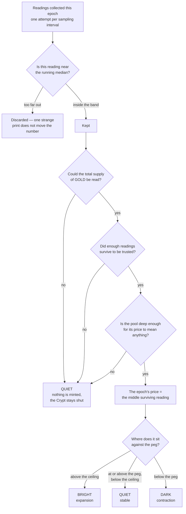
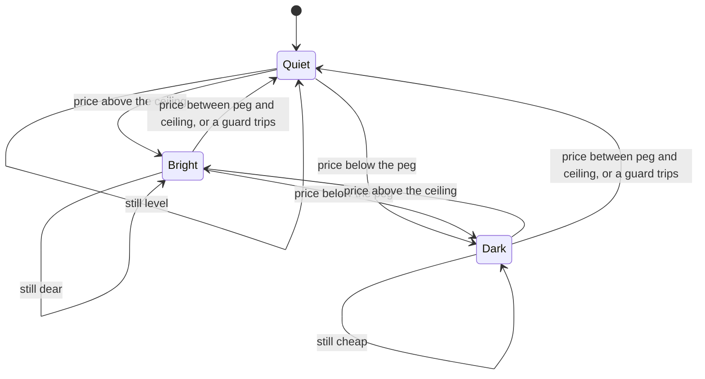
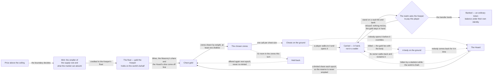
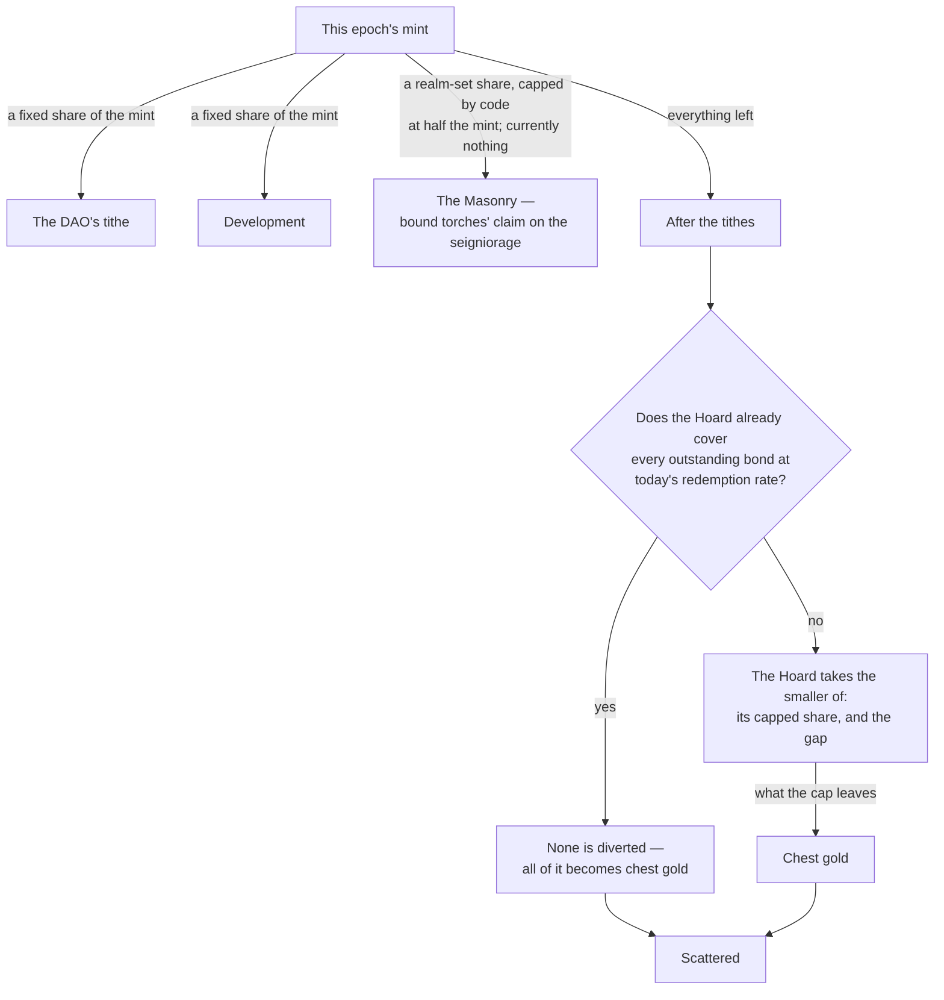
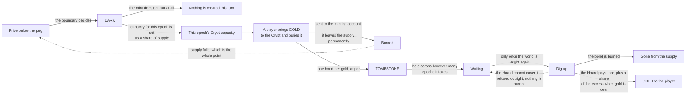
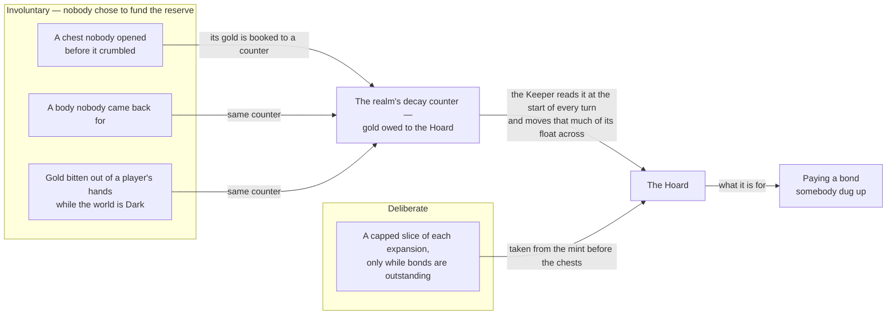
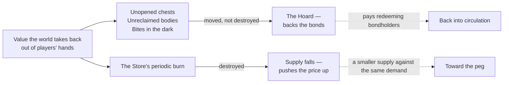

# How the peg drives the game

[The Keeper](../architecture/the-keeper.md) is the rule. [The world](../architecture/the-world.md) is what the rule
lands in. This document is the join between them, drawn rather than described:
eight diagrams that trace one turn of the monetary machine all the way down to a
player standing beside a chest deciding whether to open it.

It assumes you have read [the-keeper.md](../architecture/the-keeper.md) and [tokens.md](../architecture/tokens.md)
and does not repeat their arithmetic. What it adds is the wiring — which canister
tells which other canister what, in what order, and where a piece of value can
change hands or stop existing along the way.

One note on numbers before we start. The Keeper's shape is fixed in code; most of
its settings are not. The epoch length, the ceiling, the caps, the decay windows
and the chest table are all parameters the realm holds and can change. Where a
figure below is a setting rather than a law, it says so.

---

## 1 · What the boundary decides

Between boundaries the Keeper does exactly one thing: it reads the price of GOLD
in ICP from the trading pool, on a fixed interval, and keeps the reading if it is
close enough to the running median of the readings it already has. A print far
from the middle is discarded rather than averaged in. A failed read is skipped
rather than counted as zero.

At the boundary that pile of readings has to become a decision.



Three things are worth reading off that diagram.

The three guards all fail the same way. Whether the ledger was unreadable, the
feed was too sparse, or the pool was too thin to price, the answer is the same:
Quiet. No mint, no bond sale. There is no branch anywhere in the machine where
being confused causes it to create money.

The epoch's price is a **median**, not an average. The filter only rejects
readings far from the middle, so a wick that squeaks in at the edge of the band
would still drag a mean — and a mean dragged below the peg turns the world Dark
for a whole epoch on a price that never happened. The middle reading cannot be
moved by one sample at the edge.

And the liquidity guard is the load-bearing one. A seigniorage peg reads its own
market, so a market thin enough to shove is a market that could be used to make
the Keeper mint. Below the depth the realm has set, the price is treated as
unreadable rather than as cheap. Draining the pool does not unlock the mint; it
switches it off.

---

## 2 · The three moods, and what each opens

The mood is not a mode the world drifts through. Each boundary recomputes it from
scratch, so every transition is available at every boundary, including staying
where it is.



| | Bright | Quiet | Dark |
|---|---|---|---|
| minting | yes, bounded by what the market can absorb | no | no |
| new gold chests | scattered across the chosen zones | scattered, funded from the Hoard | scattered, funded from the Hoard |
| new item chests | restocked to each zone's target | restocked | restocked |
| burying GOLD for a bond | refused | refused | open, up to this epoch's capacity |
| redeeming a bond | open, while the Hoard covers it | refused | refused |
| skeletons take carried gold | no | no | yes |
| chests already on the ground | still there, still ageing | still there, still ageing | still there, still ageing |

The two chest rows are the ones players feel, and they used to read differently.
Gold chests once appeared only in Bright epochs, which meant the canyon stopped
producing gold entirely whenever GOLD traded at or below its peg — the floors went
quiet at exactly the moment they most needed people walking them. That is no
longer how it works. **Every epoch stocks gold chests, in every mood.**

What changes between the moods is where the gold comes from. A Bright epoch can
mint some of it, because the market is asking for more GOLD than exists. A Quiet
or Dark epoch mints nothing at all — it draws instead on the **Hoard**, the gold
the world has already lost and recovered: chests nobody found before they
crumbled, bodies nobody walked back to reclaim, gold bitten off the careless in
the dark. None of that is new supply. It is the same gold going round again, and
the Hoard is deliberately spent slowly enough that it can never be emptied.

So the old advice — that a dull epoch is only worth walking for what somebody else
left lying around — is out of date. It is still true that everything scattered in
earlier turns is still there, on a clock. But a Quiet epoch is now stocking fresh
floors of its own.

The Crypt is strictly one-directional per mood — you can only buy a bond when the
price is under the peg, and only redeem one when it is over. That is the whole
trade. The bond is a promise to be patient across a mood change, and the machine
enforces the patience.

---

## 3 · Expansion: from mint to a balance that is actually yours

This is the diagram the rest of the design hangs off. Solid arrows are the happy
path; dotted arrows are where value leaves the player and goes somewhere else.

Two things about it are worth reading twice. The mint is the **smaller** of two
rules — the old share-of-supply ceiling, and how much GOLD the market could take
without pushing the price back under the peg. A mint big enough to drive the
price further from the peg is not a defence of the peg, so the Keeper does not
make one. And the Hoard now feeds chest gold as well as bonds, which is why the
dotted arrows that carry losses into it have a solid one coming back out.



Read the solid path first. The Keeper mints into its own float and never pays a
player directly out of an expansion. It subtracts the tithes, then the share owed
to bound torches if the realm has turned that dial on, then whatever the Hoard is
owed — that last split is section 4. What remains is chest gold, and it is handed
to the realm as instructions: this many chests of this size, in this zone. The
realm chooses the tiles.

Zone choice is deliberately unstable. Each expansion the configured weights are
jittered before anything is drawn, and roughly one epoch in three drops a zone
entirely and spreads its share across the others. Then up to a set number of
zones — itself a realm setting — is drawn by weight without replacement, with a
guarantee that at least one shallow zone is among them, so a new player with
nothing bound still has ground worth walking. The chip at the top of the screen
names them.

The default chest table makes every chest worth one GOLD, which turns an
expansion into as many finds as it has gold in it: small wins, a great many of
them, spread over most of the world. The realm can replace that table, and the
table still has a row per depth, so a future one can make the deep floors generous
again without touching any code.

There is a ceiling on placement — the number of zones drawn times the per-zone
chest cap. When a mint outgrows it the surplus is not lost and not minted twice:
it is held back and offered again at the next expansion. That is the `Held back`
loop in the diagram, and it is the reason the Keeper tracks minted-but-unplaced
gold as its own quantity.

Now read the dotted arrows, because they are the distinctive part.

**A chest is not a payment.** It is gold with a clock on it, sitting on a tile,
addressed to nobody. Four epoch turns after it is placed — about a day at the
current epoch length — it crumbles, and its gold is booked to the Hoard.

**Carried gold is not banked gold.** Opening a chest moves value into your hands,
and hands can be emptied. Die and the gold lies with your body where you fell,
recoverable if you get back to it and gone to the Hoard if you do not. While the
world is Dark, a skeleton that reaches you can take a share of what you are
carrying — a realm-set fraction, currently a twentieth, never less than one GOLD
— and that goes to the Hoard too.

**Banking is the only thing that makes it yours,** and it is a real handshake, not
a bookkeeping entry. Stand on a vault tile; the realm holds the amount and asks
the Keeper to pay it; only once the ledger transfer has actually succeeded does the
realm move the gold from carried to banked. If the Keeper refuses, nothing changes
and the gold is still in your hands to try again with. From that moment on it is an
ordinary token under the player's own identity, and the game has no claim on it.

So the walk back is the tax, and the distance is the game.

---

## 4 · Where a mint actually goes

The split is where the peg's obligations and the game's supply of things to find
compete for the same gold, and the order of subtraction matters.



The debt figure the Hoard is measured against is not the number of bonds
outstanding — it is what those bonds would cost to redeem *at today's price*,
premium included. When gold is dear the premium rises, the debt rises with it, and
the Hoard's claim on the mint rises too. The reserve is sized against the promise,
not against the headline.

The cap on the Hoard's share is really a floor under the players'. However
enormous the outstanding debt, the Hoard can take at most a fixed fraction of what
is left after the tithes, so a set share of what is left always reaches the ground
as chests. The reserve can be topped up hard; it can never take an entire
expansion and leave the canyon empty. A peg that starves its own game to pay its
bondholders has no game left to generate the flows that fill the reserve.

---

## 5 · Contraction, and the round trip a bond makes



Two limits sit on the buying side and both are proportions of supply rather than
fixed sums: how much may be buried in any one epoch, and how many bonds may be
outstanding in total. Both are realm settings. Together they mean a contraction
cannot mortgage the whole supply in an afternoon, however cheap gold gets.

The redemption side has exactly one limit, and it is the important one: **a bond is
a claim on the Hoard and on nothing else.** If the Hoard cannot cover a redemption,
the redemption is refused — the bond is not burned, and no gold is created to pay
it. That single refusal is what stops the classic failure mode, in which a peg
under stress prints to honour its bonds and turns a discount into a spiral.

It also means the bond is only as good as what fills the reserve. So the honest
question to ask this design is not "what is the premium?" but "where does the
Hoard's money come from?"

One detail on both legs. Burying and digging up each move two tokens in sequence,
and if the second leg fails after the first has succeeded, the amount is credited
to the player as an owed balance they can claim later. No leg is ever quietly lost.

---

## 6 · What fills the Hoard

This is the mechanism that distinguishes the design from the forks that died, so
it gets a diagram of its own.



The claim being made here is about the *first* box, not the second. The
deliberate slice is ordinary Tomb design and it depends on there being an
expansion to slice — which is to say it works least well exactly when it is needed
most, because a peg under the peg is not minting.

The three involuntary flows have the opposite shape. None of them requires anyone
to believe the peg will recover. None of them requires a decision to support it.
They happen because people are people: they miss chests, they die a long way from
their body, they push their luck in a dark epoch carrying more than they should. A
world with busy, careless, ambitious players is a world with a well-funded bond
reserve, and it fills up whether the price is 1.20 or 0.80. The patient are paid
by the careless.

The handover itself is careful. The realm books decayed gold to a counter; the
Keeper reads the counter, moves that much of its own float into the Hoard, and only
then tells the realm the debt is settled. If that last message fails, the amount
stays outstanding and is retried before any new sweep, so the same gold is never
moved twice.

### The fire is not the reserve

One flow is often lumped in with the Hoard and should not be. Every second
purchase at the Store burns half its price — a realm setting, both the cadence and
the fraction. That gold does not go to the Hoard. It goes to the ledger's minting
account, which is to say it stops existing.



Two different levers pointed at the same target. The decay flows make the *promise*
credible; the burn makes the *price* recover. Spending in the Store is the one
everyday action that pushes the peg the right way, which is why it is worth doing
in a Bright epoch rather than hoarding for a rainy one.

---

## 7 · One turn, in order

Finally, the tick itself: who calls whom, and what each step settles.

```mermaid
sequenceDiagram
    autonumber
    participant CLK as The clock
    participant K as The Keeper
    participant POOL as The pool
    participant L as The ledgers
    participant W as The realm

    Note over K,POOL: between boundaries, this is the only thing that happens
    loop every sampling interval
        K->>POOL: read the price
        POOL-->>K: a reading, or nothing
        K->>K: keep it only if it sits near the running median
    end

    CLK->>K: the boundary arrives
    K->>K: close the reading set; reset this turn's counters
    K->>L: total supply, float, Hoard, bonds outstanding
    L-->>K: balances; a supply it cannot read ends the turn Quiet here
    K->>W: what decayed since I last asked?
    W-->>K: an amount of gold
    K->>L: move that much of the float into the Hoard
    K->>W: that amount is settled — take it off your counter
    K->>POOL: is there still enough depth to price?
    POOL-->>K: liquidity — or the turn goes Quiet here
    K->>K: the epoch's price is the middle surviving reading
    K->>K: above the ceiling, under the peg, or between? that is the mood

    alt Bright
        K->>K: value the outstanding bonds at today's premium
        K->>K: how much can the market absorb at this depth and this premium?
        K->>L: mint the smaller of that and the supply rule, into the float
        K->>L: pay the DAO, pay development, pay the Masonry share
        K->>L: top up the Hoard, capped so chests keep their floor
    else Dark
        K->>K: set this epoch's Crypt capacity as a share of supply
    else Quiet
        K->>K: no mint, and the Crypt stays shut in both directions
    end

    K->>L: draw this epoch's chest budget from the Hoard, within its limit
    K->>K: jitter the weights, draw the zones, plan each zone's chests
    loop one call per chest size, per zone
        K->>W: place this many chests of this size here
        W-->>K: placed, or refused
    end
    Note over K: anything refused is held back for the next epoch

    K->>W: the mood is now Bright / Quiet / Dark
    Note over W: this message is also the world's clock — it advances the realm's<br/>own epoch, which ages chests, bodies and dropped items,<br/>and books what crumbled to the decay counter
    K->>W: how much gold is out there in chests, hands and bodies?
    W-->>K: a figure
    K->>K: compare it against the float and record the difference
```

**The chest step sits outside the mood branch.** That is deliberate, and it is the
most recent change to this diagram: stocking the floors is something every epoch
does, not something only an expansion does. A Bright epoch can add newly minted
gold to the budget; a Quiet or Dark one funds it entirely from the Hoard. Either
way the world gets chests.

Three more things in that sequence are easy to miss.

**The sweep happens before the mint, not after.** The Keeper collects what
crumbled during the previous turn as its first real act, so the Hoard's balance is
current by the time the split decides how much of this turn's mint it still needs.
A reserve that filled itself overnight from unopened chests may need nothing at
all, and the players get the whole expansion.

**The mood push is the world's clock.** The Keeper does not run a second timer
inside the realm. The single message that tells the world which mood to paint is
the same message that advances the realm's epoch counter — which is what ages
chests toward crumbling, ages bodies toward the Hoard, and turns the dragon and
restock schedules over. One clock and one message, and a push that does not land
is counted rather than shrugged off, because a world whose epoch has stopped
advancing is a world where nothing decays.

**The last step is a reconciliation.** At the end of every turn the Keeper asks the
realm how much gold is out there in chests, hands and bodies, and compares that
against what its own float is holding on the world's behalf. Those two numbers are
computed by completely different routes through two different canisters. The gap
between them should be the gold still waiting to be placed and nothing else, so
what the Keeper watches is not the size of the gap but whether it is growing.
That is how a discrepancy becomes something you notice in hours rather than
months.

---

## What this is for

A seigniorage peg needs a reserve behind its bonds. Most of the ones that failed
funded that reserve from expansion — which is to say they funded it best when the
price was already high and not at all when it was low, and asked holders to
volunteer for the rest. The bet here is that a game generates a different kind of
flow: small, constant, involuntary, and completely indifferent to what anyone
thinks the price is going to do next. None of it is a fee, and none of it requires
belief.

Whether it is enough is a question for the ledgers, not for a document. The supply,
the Hoard, the bonds outstanding, the price each turn acted on and where every
chest fell are all readable by anyone who wants to check the arithmetic — which is
the point of publishing the rule rather than the reassurance.

Where to go next: [the-keeper.md](../architecture/the-keeper.md) for the arithmetic in full,
[the-world.md](../architecture/the-world.md) for what the canyon does with it,
[tokens.md](../architecture/tokens.md) for the three ledgers, and
[architecture.md](../architecture/architecture.md) for why the mint and the world are separate
canisters in the first place.
